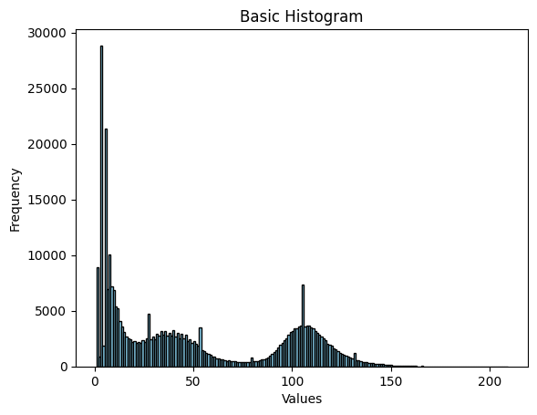

# Object Tracking using OpenCV 

- I wrote this code was my attempt to solve a problem faced during MS Thesis work of Mr. G. P. Hrishikesh Undergrad at IISER Kolkata. 
- As this is ongoing work not much about it can be revealed except experiment required programatically tracking beads during the course of the experiment.
- Shoutout to G.P. Hrishikesh who was kind enough to discuss his exciting work with me.

# Approach for solving this problem

  ### Some relevant observations
  - Red colored beads in an petri dish are moving under influence of certain forces.
  - There is a overhead lamp which shines on the bead.
  - Between each frame the displacement of bead is less than the diameter
  
  ### Constructing solution
  - OpenCV allows thresholding a grayscale image - which in this case can be used to determine the edges of the beads
  - Determining the perfect threshold edges of beads is very hard and requires lage number of trial error, once detemined this threshold may not be useful for next frame as beads move the centr hole position changes and lighting condition change as well.
  - we instead use the reflection of overhead lamp on each bead for threshholding, as the beads are spherical and the lamp is also round the center of this threshholding contour and the center of the bead are aproximately same
  - just using these points we write a the code 
  - please find the appropiately commented code in [track.py](track.py)

# Input and the Result

- The [original video](dark_bg.mp4) (the below file is for representation purpose only) 

https://github.com/user-attachments/assets/e4290d29-91c4-4932-ae51-097a7e9e1f28

- The [output video](gray_0.mp4) (the below file is for representation purpose only)


https://github.com/user-attachments/assets/4bf594ed-e06b-4df5-8a48-d4b9fee978fe

- The countour sizes were observed as follows
- this distribution hepls us determine the contour cutoff length


- Output can be found at [pickled output data in npy format](bead_tracks.npy)
- which can be loaded as follows


```python
tracks_array = np.load('bead_tracks.npy',allow_pickle=True)
print(np.shape(tracks_array))
```
